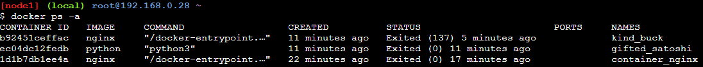

# Docker image shipping using github actions

## 15 most used docker commands

1. docker pull nginx
- pull nginx image from docker hub registry to local machine

2. docker images
- To check the list of images pulled from the dockerhub registry

3. docker run -d --name container_nginx -p 8000:80 nginx
- To run nginx docker image in detached mode

4. docker ps
- To see the current list of running containers and running ports

5. docker stop 1d1b7
- To stop the container that is up and running

6. docker ps -a
- To get the history of containers that are exited as well as up and running

 
 7. docker login
 - To login to user owned dockerhub

8. docker kill b924
- force shutdown of the container with id=b924

9.  docker rm b924
- To remove container with id=b924

**Before**

**After**

10. docker rm $(docker ps -a -q)
- remove a particular container with id=df88

11. docker rmi nginx
- remove a specified image

12. docker rm $(docker ps -a -q)
- remove all the containers present in the machine

13. docker rmi $(docker images -a)
- remove all the images present in the machine

14. docker build -t myimage .
- building a docker image

15. docker push abhishekvarma979/app:latest
- pushing the built image to the docker registry

## Task2:

### Run the hello-world image

